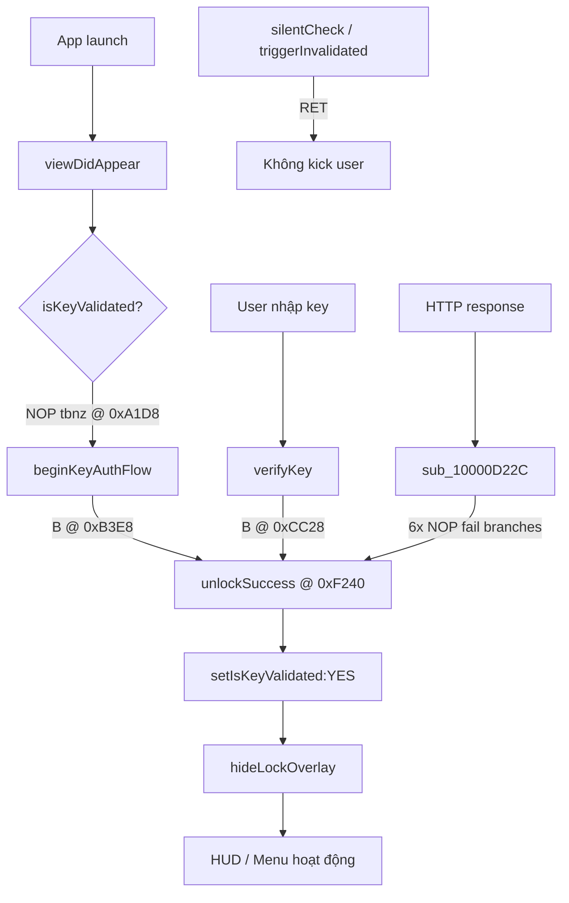

# FFExternal VNMOD CRACK — (security check)

> **Mục đích:** Tài liệu này dùng để **tự kiểm thử anti-crack** trên build FFExternal của bạn (arm64, iOS).  
> Binary tham chiếu: `FFExternal` v1.0.1, UUID `ef3291ca-93ff-383d-91b9-c2424f61b50b`, image base `0x100000000`.

---

## 1. Tóm tắt

App dùng **license key** qua Firebase Realtime Database. Toàn bộ logic verify nằm trên client; chỉ cần patch vài nhánh ARM64 (~47 byte thay đổi) là bypass login, mở menu HUD mà không cần key hợp lệ.

**Patch cuối cùng (ổn định):** nhảy `beginKeyAuthFlow` / `verifyKey` → `unlockSuccess`, NOP các nhánh fail HTTP, tắt re-check nền. **Không** inject code cave.

---

## 2. Luồng xác thực key (gốc)

```
viewDidLoad
  └─ createLockOverlay          (full-screen lock che UI)

viewDidAppear
  └─ isKeyValidated?
       ├─ NO  → beginKeyAuthFlow
       └─ YES → bỏ qua auth

beginKeyAuthFlow
  └─ showCheckingKeyOverlay
  └─ đọc SavedServerKey (NSUserDefaults)
  └─ verifyKey:completion:

verifyKey:completion:
  └─ HTTP GET Firebase: {base}/keys/{key}.json
  └─ sub_10000D22C (parse response)
       ├─ statusCode == 200
       ├─ JSON dictionary, field "active" == true
       └─ OK → unlockSuccess:
            ├─ setIsKeyValidated:YES
            ├─ stopExitCountdown
            ├─ hideLockOverlay
            └─ startRealtimeKeyMonitor
                 └─ timer → silentCheckCurrentKey (re-verify định kỳ)

Thất bại → triggerKeyInvalidatedUI → SetHUDEnabled(false) + countdown thoát app
```

**Server (giải mã XOR `0x5E`):**

- URL: `https://updatesevertipaktienxios-default-rtdb.asia-southeast1.firebasedatabase.app/`
- Path: `%@/keys/%@.json`
- Fields: `active`, `activated_at`, `wrong_attempts`
- Key lưu local: `SavedServerKey` (NSUserDefaults)
- Device ID: `TIPA_DeviceID`

---

## 3. Bảng địa chỉ hàm quan trọng

| Hàm | Địa chỉ (VMA) | Size | Ghi chú |
|-----|---------------|------|---------|
| `-[HomeViewController viewDidAppear]` | `0x10000A198` | — | Gọi `isKeyValidated` rồi `beginKeyAuthFlow` |
| `-[HomeViewController createLockOverlay]` | (trong `viewDidLoad` ~`0x100009E04`) | — | Overlay khóa màn hình |
| `-[HomeViewController createCheckingKeyOverlay]` | `0x10000A628` | `0x648` | Overlay "checking key" |
| `-[HomeViewController showCheckingKeyOverlay]` | `0x10000ADD8` | `0x138` | |
| `-[HomeViewController hideCheckingKeyOverlay]` | `0x10000AF50` | `0x88` | |
| `-[HomeViewController deviceID]` | `0x10000B050` | `0x2D8` | Bind license theo máy |
| **`-[HomeViewController beginKeyAuthFlow]`** | **`0x10000B3E8`** | `0x2C8` | **Điểm patch → unlock** |
| `-[HomeViewController submitKey:]` | `0x10000C6A0` | `0x154` | Nhập key thủ công |
| **`-[HomeViewController verifyKey:completion:]`** | **`0x10000CC28`** | `0x4A0` | **Điểm patch → unlock** |
| **`sub_10000D22C` (HTTP handler)** | **`0x10000D22C`** | `0x1064` | Parse JSON / check `active` |
| `-[HomeViewController URLSession:...didReceiveChallenge:]` | `0x10000E700` | `0x16C` | SSL — chấp nhận server trust |
| `-[HomeViewController patchKey:fields:]` | `0x10000EC50` | `0x4A4` | PATCH key lên Firebase |
| **`-[HomeViewController unlockSuccess:]`** | **`0x10000F240`** | `0x5C` | **Mục tiêu nhảy khi crack** |
| `-[HomeViewController startRealtimeKeyMonitor]` | `0x10000F29C` | `0x114` | Timer re-check |
| **`-[HomeViewController silentCheckCurrentKey]`** | **`0x10000F460`** | `0x210` | **Điểm patch → RET** |
| **`-[HomeViewController triggerKeyInvalidatedUI:]`** | **`0x10000F9DC`** | `0x3E8` | **Điểm patch → RET** |
| `-[HomeViewController isKeyValidated]` (getter) | `0x1000121DC` | — | Đọc BOOL ivar |
| `-[HomeViewController setIsKeyValidated:]` | `0x1000121F0` | — | Ghi BOOL ivar |
| `decrypt_string_xor5e` (len 15) | `0x100012DE8` | `0x64` | Giải mã chuỗi ngắn |
| `decrypt_string_xor5e` (len 6) | `0x100012568` | `0x64` | |
| `decrypt_string_xor5e` (len 0x53) | `0x100012E70` | `0x64` | URL Firebase |
| `_objc_msgSend` stub | `0x1000380BC` | — | Dùng khi viết trampoline |
| `SetHUDEnabled(bool)` | `0x10000A200` (gọi từ nhiều nơi) | — | Bật/tắt HUD overlay game |
| `HUDFloatButtonHandleTouch` | `0x100005C74` (caller) | — | Nút bánh răng / float button |

### Selref `__DATA` (tham khảo)

| Selector | Selref slot |
|----------|-------------|
| `setIsKeyValidated:` | `0x100050B40` |
| `hideCheckingKeyOverlay` | `0x100050D80` |
| `stopExitCountdown` | `0x100050DB0` |
| `hideLockOverlay` | `0x100050F70` |
| `startRealtimeKeyMonitor` | `0x100050F78` |
| `showSpinnerMessage:` | `0x100050E40` |
| `isKeyValidated` | `0x100050CA8` (trong `viewDidAppear`) |

---

## 4. Lỗ hổng anti-crack

| # | Lỗ hổng | Mức độ | Chi tiết |
|---|---------|--------|----------|
| 1 | **Client-only gate** | Cao | `isKeyValidated` là BOOL trên client; `unlockSuccess` gọi công khai |
| 2 | **Obfuscation chuỗi yếu** | Cao | XOR cố định `0x5E` — extract bằng `export_key_pseudocode.py` |
| 3 | **HTTP fail branches patchable** | Cao | 6 nhánh `b.ne`/`cbz` trong `sub_10000D22C` NOP là qua verify |
| 4 | **Re-check tắt được bằng RET** | Trung bình | `silentCheckCurrentKey` / `triggerKeyInvalidatedUI` → `RET` |
| 5 | **SSL pinning yếu** | Trung bình | `didReceiveChallenge` chấp nhận server trust |
| 6 | **Key lưu NSUserDefaults** | Trung bình | `SavedServerKey` đọc/ghi plaintext |
| 7 | **Không integrity check binary** | Cao | Patch `__TEXT` không bị phát hiện |
| 8 | **"Code cave" giả** | Thiết kế | `0x1000175C8` trông như NOP nhưng là **code UI menu** — patch nhầm → crash menu |

---

## 5. Patch crack (phiên bản cuối — dùng được)

Script: `patch_key_bypass_test.py`  
Input: bản **gốc** `SAVED/FFExternal.app/FFExternal` (hoặc `FFExternal.original`).

| # | Địa chỉ | Patch (ARM64) | Opcode (hex) | Hiệu ứng |
|---|---------|---------------|--------------|----------|
| 1 | `0x10000B3E8` | `B unlockSuccess` | tính theo offset | `beginKeyAuthFlow` → unlock ngay |
| 2 | `0x10000CC28` | `B unlockSuccess` | tính theo offset | `verifyKey` → unlock ngay |
| 3 | `0x10000A1D8` | `NOP` | `1F 20 03 D5` | Luôn gọi `beginKeyAuthFlow` (ẩn lock overlay) |
| 4 | `0x10000F460` | `RET` | `C0 03 5F D6` | Tắt `silentCheckCurrentKey` |
| 5 | `0x10000F9DC` | `RET` | `C0 03 5F D6` | Tắt `triggerKeyInvalidatedUI` |
| 6 | `0x10000F28C` | `NOP` | `1F 20 03 D5` | Không gọi `startRealtimeKeyMonitor` trong `unlockSuccess` |
| 7 | `0x10000D288` | `NOP` | `1F 20 03 D5` | Bỏ nhánh lỗi error param |
| 8 | `0x10000D28C` | `NOP` | `1F 20 03 D5` | Bỏ nhánh lỗi error data |
| 9 | `0x10000D2A4` | `NOP` | `1F 20 03 D5` | Bỏ check HTTP != 200 |
| 10 | `0x10000D300` | `NOP` | `1F 20 03 D5` | Bỏ check JSON null |
| 11 | `0x10000D334` | `NOP` | `1F 20 03 D5` | Bỏ check không phải dictionary |
| 12 | `0x10000D41C` | `NOP` | `1F 20 03 D5` | Bỏ check `active` bool fail |

**`unlockSuccess` (`0x10000F240`) khi chạy gốc:**

```
setIsKeyValidated:YES  →  stopExitCountdown  →  hideLockOverlay  →  (startRealtimeKeyMonitor bị NOP)
```

### Địa chỉ **KHÔNG** được patch

| Địa chỉ | Lý do |
|---------|-------|
| `0x1000175C8` – `0x1000176E8` | Code UI floating panel / `showSpinnerMessage` / `setupContentArea` — patch đè → crash khi bấm bánh răng |
| `0x1000121DC` (getter `isKeyValidated` luôn YES) | Gây `viewDidAppear` bỏ qua `beginKeyAuthFlow` → `hideLockOverlay` không chạy → **màn hình trắng** |

---

## 6. Lỗi đã gặp khi crack (bài học)

| Triệu chứng | Nguyên nhân | Fix |
|-------------|-------------|-----|
| Crash `EXC_BAD_ACCESS` @ `0x1100080bc` | Trampoline gọi `objc_msgSend` bằng `br` absolute `0x100080bc` (sai + ASLR) | Dùng `bl` PC-relative tới `0x1000380BC`, hoặc bỏ cave |
| Crash `objc_retain` trong `showSpinnerMessage:` | Truyền C string thay vì `NSString*` | Bỏ watermark / gọi `stringWithUTF8String:` trước |
| Màn hình trắng/đen | Patch `isKeyValidated` = YES → skip `beginKeyAuthFlow` | NOP `tbnz` @ `0x10000A1D8`, không patch getter |
| Menu bánh răng crash `doesNotRecognizeSelector` | Ghi trampoline đè code @ `0x1000175C8` | Nhảy `unlockSuccess`, không dùng cave |

---

## 7. Cách chạy (developer test)

### Xuất pseudocode / phân tích

```bash
cd "/FFExternal.app"
pip install capstone
python3 export_key_pseudocode.py --binary FFExternal.original --out ./key_auth_pseudocode
```

### Patch crack

```bash
# Luôn patch từ bản GỐC
python3 patch_key_bypass_test.py \
  --binary "/FFExternal.app/FFExternal" \
  --out FFExternal.cracked

cp FFExternal.cracked FFExternal
codesign -f -s "Your Identity" .
```

### File trong thư mục app

| File | Mô tả |
|------|--------|
| `FFExternal.original` | Backup binary sạch (copy từ Payload 4) |
| `FFExternal.cracked` | Binary đã patch |
| `patch_key_bypass_test.py` | Script patch |
| `export_key_pseudocode.py` | Script export pseudocode |
| `key_auth_pseudocode/` | Pseudocode từng hàm |

---

## 9. Sơ đồ patch (cuối)



---

*By X2NIOS.*
